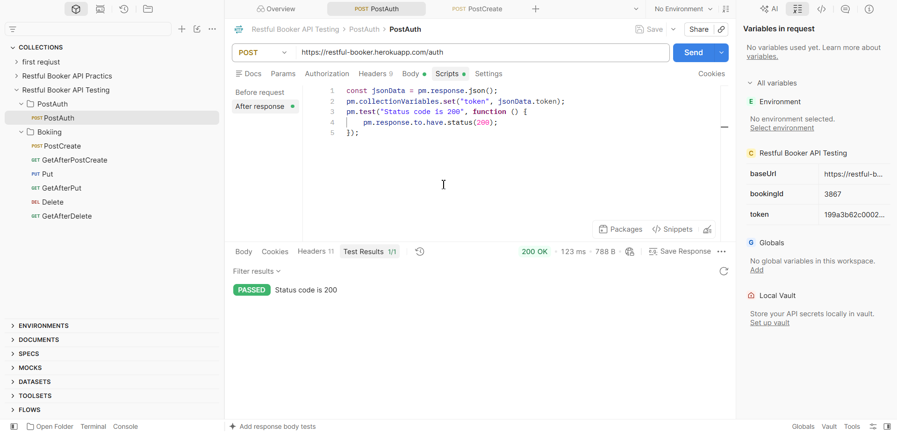

API Testing — RESTful Booker
About the Project

This project demonstrates API testing using Postman and the RESTful Booker public demo API.

The collection covers authentication and CRUD operations for booking management, including response validation and JavaScript test scripts.

Tools & Technologies
Postman — API requests and test execution
REST API — HTTP methods and status codes
JSON — request and response data
JavaScript — automated assertions in Postman
Collection Variables — storing authentication tokens and booking IDs
Authentication

The authentication request retrieves a token and stores it in a collection variable for subsequent requests.

Booking CRUD Operations
Create Booking

Creates a new booking and stores its ID in a collection variable for use in subsequent requests.

Read Booking

Retrieves booking details and validates the response structure, field values, and data types.

Update Booking

Updates booking details and verifies that the expected changes are reflected in the API response.

Delete Booking

Deletes a booking and verifies that the resource is no longer available.

Test Results

The collection includes assertions for HTTP status codes, response fields, data types, and expected values.

Notes

This is a portfolio practice project using a public demo API. All test data is fictional and is not related to production systems.
