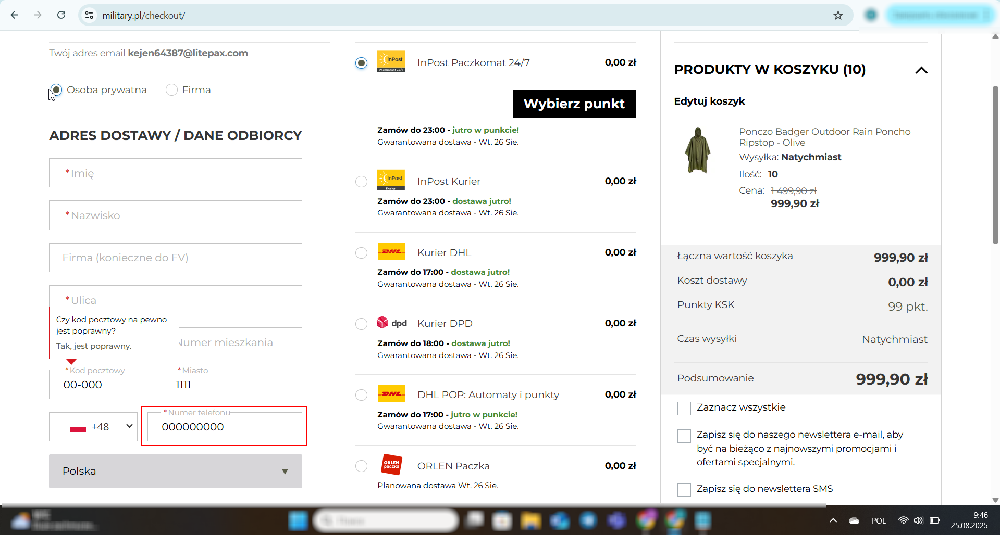

# Bug Report - Phone Number Field Accepts Invalid Input (000000000)

**Website:** [Military](https://military.pl/00)  
**Environment:**
OS: Windows 10, Browser: Chrome 126  
Date: 2025-08-25  
**Severity:** Medium  
**Priority:** Medium  
**Frequency:** Always  

---

### ✅ Steps to Reproduce:
1. Go to [https://military.pl/](https://military.pl/).
2. Add several products to the cart.
3. Click **"Przejdź do koszyka"** and then **"Przejdź do kasy"** (Checkout).
4. Fill out the required fields on the checkout page.
5. In the **Phone Number** field, enter `000000000`.
6. Click **Proceed to Payment**.

---

### ✅ Expected Result:
The system should validate the phone number and display an error message if the input is invalid (e.g., `000000000` should not be accepted).

---

### ✅ Actual Result:
The system accepts `000000000` as a valid phone number without any warning or validation message.

---

**Screenshot:**  

---

### ✅ Type of Bug:
Functional
