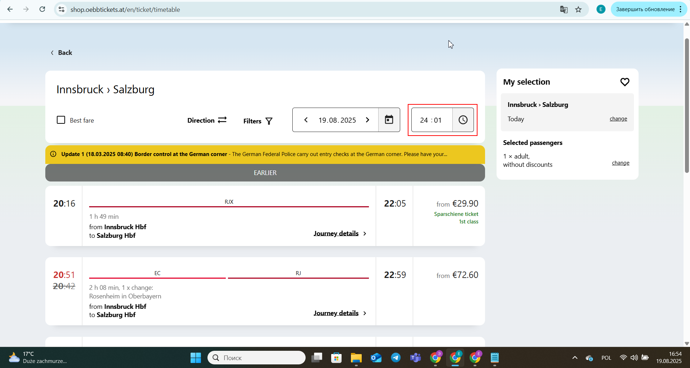

# Bug Report - Time Input Accepts Invalid Value

**Website:** [OEBB Tickets Shop](https://shop.oebbtickets.at/en/)  
**Environment:** Windows 10, Chrome  
**Date:** 2025-08-19  
**Severity:** High  
**Priority:** High  
**Frequency:** Always  

---

## Steps to Reproduce
1. Open the [OEBB Tickets Shop](https://shop.oebbtickets.at/en/).  
2. Enter `Innsbruck` in the "From" field.  
3. Enter `Salzburg` in the "To" field.  
4. Press **Enter** to confirm locations.  
5. Manually enter `24:01` in the time field.  

---

## Expected Result
The system should show an error message or prevent entering an invalid time.  

---

## Actual Result
The website accepts `24:01` without any warning or error.  

---

## Screenshot

---

## Notes
This issue can cause confusion for users and may affect downstream booking logic.  

---

## Suggested Type
Functional Bug
