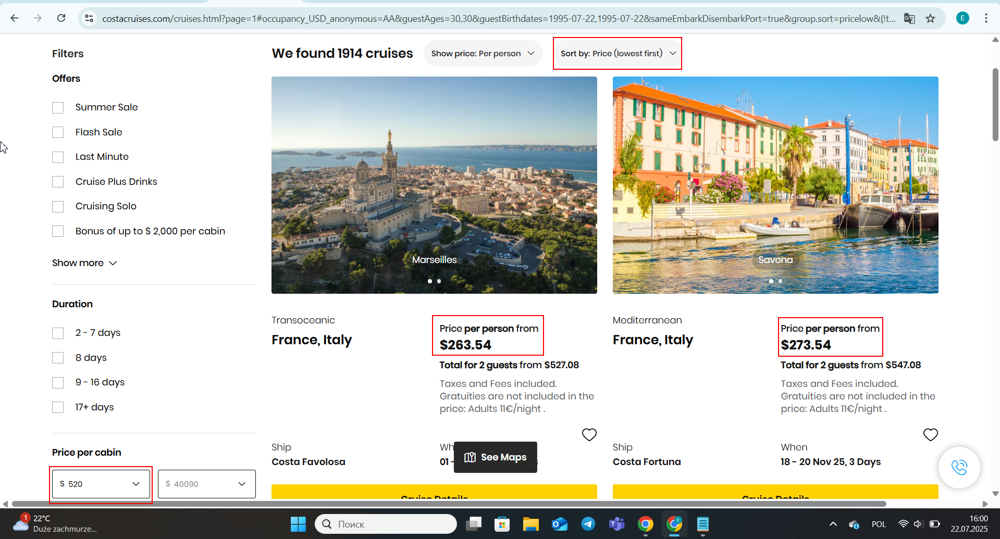

# Bug Report - Time Input Accepts Invalid Value

**Website:** [Costa Cruises](https://www.costacruises.com)  
**Environment:** Windows 10, Chrome  
**Date:** 2025-08-19  
**Severity:** Medium  
**Priority:** Medium  
**Frequency:** Always

---

## Steps to Reproduce
1. Go to [Costa Cruises homepage](https://www.costacruises.com)
2. Click on the Search (magnifying glass) icon in the top right corner
3. Scroll down to the **Price filter** section
4. Set the minimum price to **€520**
5. Click **Apply** to apply the filter
6. Observe that cruises with prices lower than €520 are shown in the search results

---

## Expected Result
Only cruises with prices equal to or higher than €520 should be displayed in the search results.

---

## Actual Result
Cruises with prices as low as €236.54 are shown in the search results, despite setting the minimum price filter to €520.

---

## Verification Checklist
- **Title format in overview:** ✅ Correct
- **Steps start with homepage URL and include all steps:** ✅ Correct
- **Expected result written correctly:** ✅ Correct
- **Actual result written correctly:** ✅ Correct
- **Screenshot attached:** ✅ Yes, highlighted screenshot uploaded

---

## Environment
- **Website Country / Language:** United States / English
- **Tester Location:** Poland

---

## Attachments
- 

---

## Type of Bug
Functional

  

